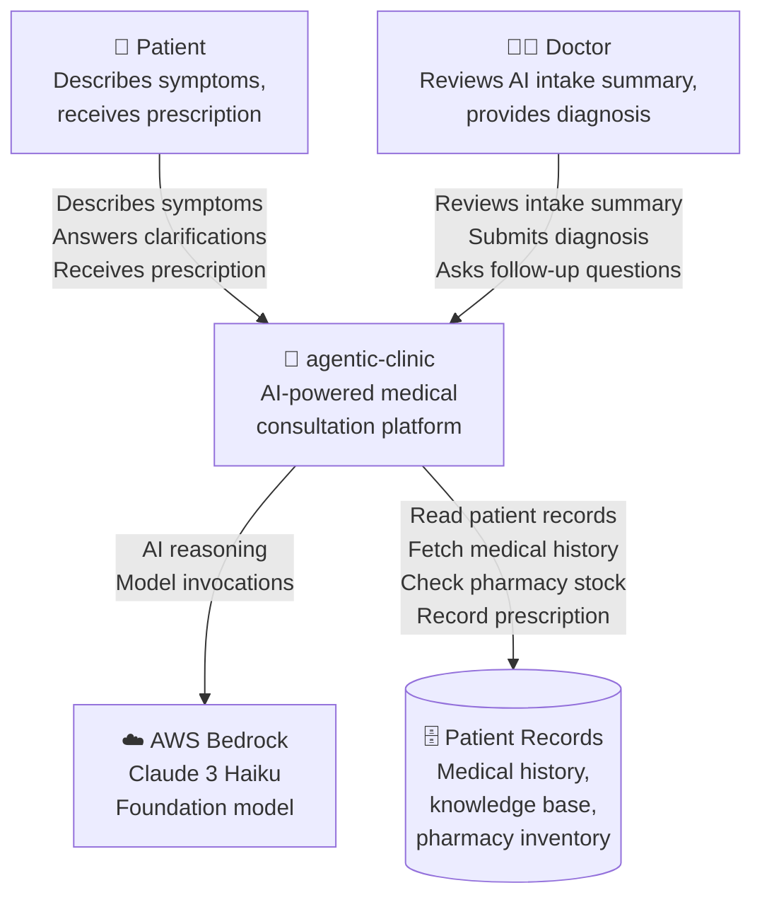
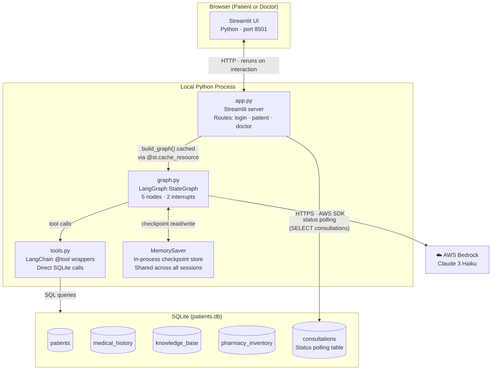
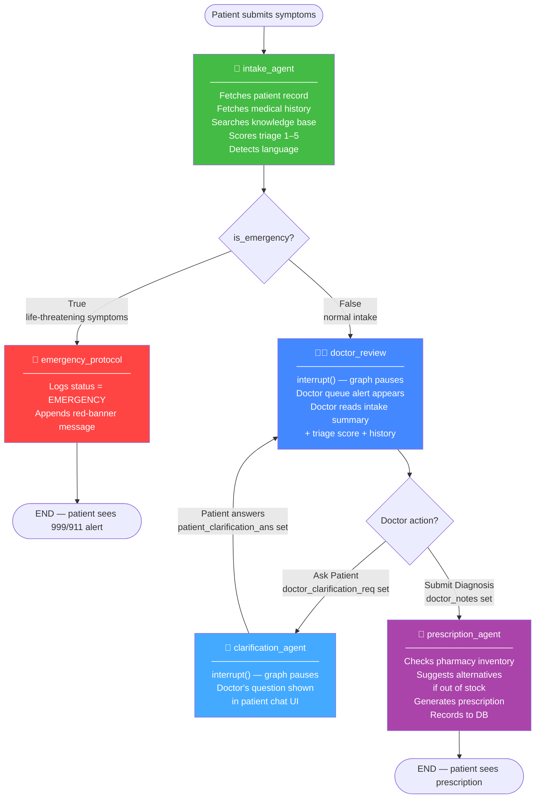
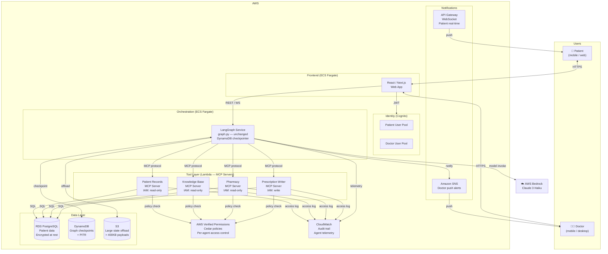

# Architecture — agentic-clinic

> This document covers the current POC architecture, the target production architecture, how each roadmap phase transforms the system, and the key decisions behind the design.

---

## Contents

1. [C4 Level 1 — System Context](#c4-level-1--system-context)
2. [C4 Level 2 — Container Diagram (POC)](#c4-level-2--container-diagram-poc)
3. [LangGraph Workflow](#langgraph-workflow)
4. [Architecture by Phase](#architecture-by-phase)
5. [C4 Level 2 — Container Diagram (Production)](#c4-level-2--container-diagram-production)
6. [Architecture Decision Records](#architecture-decision-records)
7. [Key Tradeoffs](#key-tradeoffs)

---

## C4 Level 1 — System Context

> Who uses the system and what external systems does it depend on?



**External dependencies:**
- **AWS Bedrock** — the only cloud service the POC touches; pay-per-token, no idle cost
- **Patient Records** — SQLite in POC; RDS/DynamoDB in production

---

## C4 Level 2 — Container Diagram (POC)

> What are the deployable units and how do they communicate?



**Key characteristic:** The `MemorySaver` checkpointer is shared across all browser sessions because `get_graph()` is decorated with `@st.cache_resource` — a single Python object in the server process. This makes the patient → doctor state handoff work without any network calls.

---

## LangGraph Workflow

> How does a consultation flow through the graph?



### State object

```
ConsultationState
├── session_id, patient_id, symptoms
├── patient_history          ← populated by intake_agent via tools
├── intake_summary           ← English, for doctor
├── is_emergency             ← triggers triage edge
├── triage_score  (1–5)      ← sorts doctor queue
├── triage_reason            ← shown under intake summary
├── doctor_clarification_req ← triggers clarification edge
├── patient_clarification_ans
├── doctor_notes
├── prescription
├── status                   ← polled by Streamlit UI
└── messages                 ← patient chat history
```

---

## Architecture by Phase

Each phase upgrades **one concern** without touching `graph.py`.

| Component | POC | Phase 1 | Phase 2 | Phase 3 | Phase 4 | Phase 5 |
|-----------|-----|---------|---------|---------|---------|---------|
| **LLM** | Haiku (Bedrock) | ← same | ← same | ← same | ← same | ← same |
| **Graph topology** | 5 nodes, 2 interrupts | ← same | ← same | ← same | ← same | ← same |
| **Checkpointing** | MemorySaver | DynamoDB (`langgraph-checkpoint-aws`) | ← same | ← same | ← same | + PITR backup |
| **Patient DB** | SQLite | RDS PostgreSQL | ← same | + encryption | ← same | + Multi-AZ |
| **Tool access** | `@tool` → SQLite | `@tool` → RDS | MCP servers | + Cedar policies | ← same | + audit logs |
| **Auth** | Hardcoded PIN | ← same | ← same | Amazon Cognito | ← same | ← same |
| **Frontend** | Streamlit (local) | Streamlit (App Runner) | ← same | React / Next.js | + WebSocket | ← same |
| **Doctor notification** | Streamlit poll | ← same | ← same | ← same | SNS push | ← same |
| **Infra cost/month** | $0 | ~$25 | ~$30 | ~$50 | ~$55 | ~$80–120 |

**The invariant:** `graph.py` — nodes, edges, interrupts, conditional routing — is identical in every column.

---

## C4 Level 2 — Container Diagram (Production)

> Target state after all five phases.



---

## Architecture Decision Records

### ADR-001 — LangGraph over Lambda + Bedrock

**Status:** Accepted  
**Date:** 2026-06-20

#### Context
The initial pattern for Bedrock workloads is Lambda + Bedrock: a Lambda function receives a request, calls Bedrock, returns a response. This works well for single-turn, stateless interactions. A medical consultation requires multi-step, stateful, cyclical behaviour: intake → triage → doctor review (with possible clarification loops) → prescription. Each step may run minutes or hours after the previous one.

#### Decision
Use LangGraph as the orchestration layer. A `StateGraph` encodes the consultation workflow as nodes (agents) and edges (routing logic). State is persisted at each checkpoint, enabling the graph to pause and resume across any time boundary.

#### Consequences

**Positive:**
- Human-in-the-loop (`interrupt()`) is a first-class primitive — no custom polling or webhook logic
- Cyclic workflows (clarification loop) are native graph edges, not application-level logic
- State is typed (`TypedDict`) and validated at every node boundary
- The graph topology is infrastructure-agnostic — the same code runs on a laptop or in ECS

**Negative:**
- Adds LangGraph as a dependency; the team must learn its execution model
- Debugging a paused graph requires understanding checkpoint state rather than simple logs
- `MemorySaver` (POC) loses all state on process restart

**Mitigations:**
- LangGraph's `.get_state(config)` and `.get_state_history(config)` provide full checkpoint inspection
- Production uses DynamoDB checkpointing (`langgraph-checkpoint-aws`), which survives restarts

---

### ADR-002 — Claude 3 Haiku over Claude 3 Sonnet

**Status:** Accepted  
**Date:** 2026-06-20

#### Context
The platform targets charity hospitals where per-consultation cost is a key constraint. Two Claude models were considered: Haiku ($0.25/$1.25 per million input/output tokens) and Sonnet (~8× more expensive). Both are capable of medical-domain reasoning.

#### Decision
Use Claude 3 Haiku for all agent nodes (intake, prescription). Sonnet is not used in the POC.

#### Consequences

**Positive:**
- ~$0.001 per consultation — viable at any volume for a charity hospital
- Haiku's native multilingual capability covers the low-literacy / non-English-speaking patient demographic at no extra cost
- Structured JSON output (`triage_score`, `intake_summary`) is reliably produced by Haiku

**Negative:**
- Haiku may produce less nuanced clinical reasoning for complex, multi-comorbidity cases
- Triage scoring accuracy is lower than Sonnet for edge cases

**Mitigations:**
- The doctor is always in the loop before any prescription is finalised — AI outputs are advisory, not autonomous
- The `triage_score` is a queue-sorting mechanism, not a clinical decision; the doctor overrides it implicitly by reviewing cases in any order
- Individual nodes can be upgraded to Sonnet independently (e.g., for a specialist agent) without changing the graph

---

### ADR-003 — LangChain `@tool` Wrappers over Real MCP Servers (POC)

**Status:** Accepted (POC only — superseded in Phase 2)  
**Date:** 2026-06-20

#### Context
Model Context Protocol (MCP) is the production-grade standard for agent tool access. Implementing real MCP servers requires separate processes, IAM roles, network configuration, and client libraries — significant overhead for a prototype.

#### Decision
Implement tools as LangChain `@tool`-decorated Python functions that query SQLite directly, running inside the agent process.

#### Consequences

**Positive:**
- Zero infrastructure: no server processes, no IAM, no network config
- SQLite queries are synchronous and fast for a demo
- The tool *interface* (name, description, arguments) is identical to what an MCP client would expose — the graph nodes don't know or care about the implementation

**Negative:**
- The agent process has unrestricted DB access — no per-patient access enforcement
- No independent audit log of tool calls (tool calls appear in LangGraph traces only)
- Cannot be reused by other agent types without code duplication

**Mitigations:**
- The tool *signatures* are final; only implementations swap in Phase 2
- The separation of `tools.py` from `graph.py` makes this swap mechanical (4 function bodies)
- The roadmap documents this limitation explicitly to prevent it being treated as permanent

---

### ADR-004 — MemorySaver over SqliteSaver (POC Checkpointing)

**Status:** Accepted (POC only — superseded in Phase 1)  
**Date:** 2026-06-20

#### Context
LangGraph requires a checkpointer to support `interrupt()`. `SqliteSaver` (file-backed SQLite) and `MemorySaver` (in-process dict) are both available. `SqliteSaver.from_conn_string()` is a context manager, which creates lifecycle management complexity in a Streamlit environment where `@st.cache_resource` controls object lifetime.

#### Decision
Use `MemorySaver`. Since both patient and doctor browser sessions hit the same Streamlit server process, and the graph is cached with `@st.cache_resource`, the in-memory checkpoint store is shared across all sessions — exactly the behaviour needed for the handoff.

#### Consequences

**Positive:**
- Zero configuration; no SQLite connection lifecycle to manage
- All sessions within the same server process share the checkpoint store — patient → doctor handoff works correctly
- Eliminates the `_GeneratorContextManager` runtime error from misusing `SqliteSaver`

**Negative:**
- State is lost if the Streamlit process restarts (e.g., after a code change or crash)
- Cannot scale beyond a single process (no horizontal scaling)

**Mitigations:**
- For a demo, process restarts are acceptable — just re-seed the DB and start a new consultation
- Phase 1 replaces `MemorySaver` with `langgraph-checkpoint-aws` (DynamoDB), which is process-independent and survives restarts

---

### ADR-005 — SQLite over DynamoDB / RDS (POC Data Layer)

**Status:** Accepted (POC only — superseded in Phase 1)  
**Date:** 2026-06-20

#### Context
The POC needs a patient database, a pharmacy inventory, a knowledge base, and a consultation status table. Cloud databases (RDS, DynamoDB) add provisioning time, cost, and credential management.

#### Decision
Use SQLite for all data storage. `seed_db.py` creates and populates `patients.db` in seconds.

#### Consequences

**Positive:**
- Zero cost, zero infrastructure, zero configuration
- `patients.db` can be shared via git (gitignored — regenerated by `seed_db.py`)
- SQLite's in-process nature means the tool functions have no network latency

**Negative:**
- Cannot be accessed from more than one process simultaneously (writer lock)
- No access control, encryption, or audit logging
- Not suitable for real patient data under any circumstances

**Mitigations:**
- Tool function signatures and SQL schemas are identical to what RDS/DynamoDB would use; migration is a connection string change + schema port
- The `patients.db` gitignore ensures no accidental data leakage

---

### ADR-006 — Streamlit over React / Next.js (POC Frontend)

**Status:** Accepted (POC only — superseded in Phase 3)  
**Date:** 2026-06-20

#### Context
The POC requires two distinct UI surfaces: a patient chat interface and a doctor desktop with a triage queue. Options considered: React (full control, complex setup), Next.js (SSR + API routes, moderate setup), Streamlit (Python-native, zero JS).

#### Decision
Use Streamlit. The entire frontend is Python, consistent with the rest of the stack.

#### Consequences

**Positive:**
- The entire codebase is Python — no context-switching, no build toolchain
- Streamlit's `@st.cache_resource` provides the shared graph/checkpointer that makes the POC work
- `st.rerun()` provides adequate polling without WebSockets or server-sent events
- The patient and doctor views are clearly separated by `st.session_state["role"]`

**Negative:**
- Streamlit reruns the entire script on every interaction — not suitable for real-time UX
- No native WebSocket support; doctor notification requires polling
- Not suitable for mobile patients or concurrent-user production load
- Streamlit's execution model can be confusing when combined with LangGraph's blocking `invoke()` calls

**Mitigations:**
- Polling is acceptable for a demo where both roles are supervised
- Phase 3 replaces Streamlit with React/Next.js; the `graph.py` and `tools.py` remain unchanged
- The LangGraph service is decoupled from the frontend from Phase 1 onward

---

## Key Tradeoffs

### 1. Stateful Graph vs. Stateless Functions

| | Lambda + Bedrock | LangGraph |
|--|-----------------|-----------|
| Human handoff | Custom: webhooks, polling, state store | Native: `interrupt()` |
| Cyclic flows | Manual: loop logic in application code | Native: graph edges |
| Debugging | CloudWatch logs, straightforward | Checkpoint inspection, LangSmith |
| Cold start | ~100ms | ~200ms (graph compilation cached) |
| Scaling | Trivial (Lambda scales automatically) | Requires checkpointer in shared store |

**Verdict:** LangGraph's complexity pays off the moment you need a second human handoff, a retry loop, or parallel sub-agents. For a single-turn Q&A, Lambda is simpler.

---

### 2. In-Process Tools vs. MCP Servers

| | `@tool` wrappers (POC) | MCP Servers (Production) |
|--|----------------------|--------------------------|
| Setup time | Minutes | Days |
| Security boundary | None (same process) | IAM role per server |
| Audit trail | LangGraph traces only | CloudWatch per call |
| Reusability | Duplicated per agent | Shared across all agents |
| Cost | $0 | ~$2–5/month (Lambda) |
| Graph changes | None | None |

**Verdict:** Use `@tool` wrappers to prove the workflow; swap to MCP when security or auditability becomes a requirement. The interface contract is frozen — only the implementation moves.

---

### 3. Haiku vs. Sonnet for Clinical Reasoning

| | Claude 3 Haiku | Claude 3 Sonnet |
|--|---------------|-----------------|
| Cost per consultation | ~$0.001 | ~$0.008 |
| Multilingual | ✅ Native | ✅ Native |
| Triage accuracy | Good for common presentations | Better for complex cases |
| Structured JSON output | Reliable | Very reliable |
| Doctor always reviews | ✅ Yes | ✅ Yes |

**Verdict:** Haiku is the right default because the doctor is always the final clinical authority. Sonnet can be introduced for specific high-acuity nodes (e.g., a specialist triage agent) without changing the graph topology — just swap `model_id` in `_get_model()` per node.

---

### 4. MemorySaver vs. Persistent Checkpointer

| | MemorySaver (POC) | SqliteSaver / DynamoDB |
|--|------------------|------------------------|
| Setup | Zero | Connection string / IAM |
| Survives restart | ❌ No | ✅ Yes |
| Multi-process | ❌ No | ✅ Yes |
| Cross-tab sharing | ✅ Yes (same process) | ✅ Yes |
| Cost | $0 | $0 (SQLite) / ~$1/month (DynamoDB) |

**Verdict:** `MemorySaver` is the right POC choice precisely because its limitation (single-process) is also its benefit (automatic cross-session sharing). Production must use a persistent store — the swap is one line in `build_graph()`.
